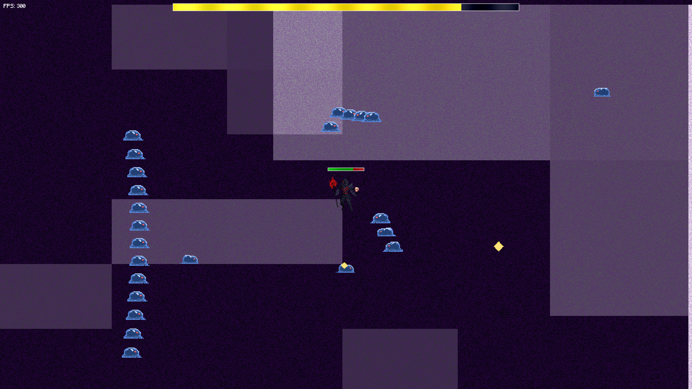

# Re:Survive

**Re:Survive** is an action-packed rogue-like bullet hell game where you must defeat everything that appears on your screen.

The game is heavily inspired by popular series such as **Re:Zero**, **JoJo's Bizarre Adventure**, and **Vampire Survivors**.

### Assets:
All in-game assets are pre-made, with the following exceptions:

- **Music**: Composed by Ori, a friend of mine.
- **Sound Effects**: All sound effects are created by me, with the exception of the lightning, witch's clock, and guardian angel sounds.
- **Graphics**: Both the menu and in-game backgrounds are created using shaders. In fact, almost every visual effect you see in the game is achieved through shaders—because shaders are awesome!

### How To Play
To play the game, you can either:
1. Download the executable from the **Releases** section.
2. Alternatively, download the source code and run it using **Love2D** (ensure you have Love2D installed on your system).

### Running the game with Love2D:
1. Download and install **Love2D** from [https://love2d.org/](https://love2d.org/).
2. Download the Re:Survive source code.
3. Drag the game folder onto the **Love2D** executable (make sure **main.lua** is in the root folder).

